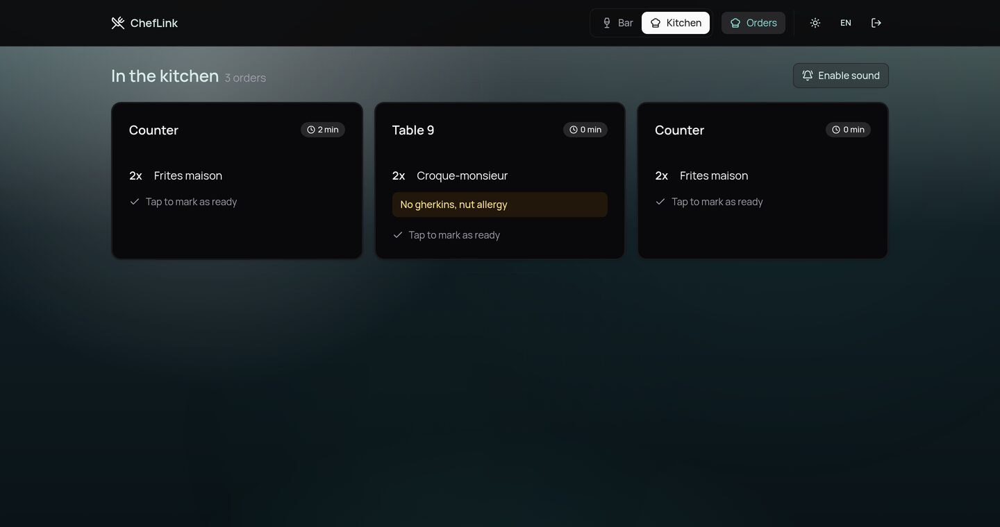
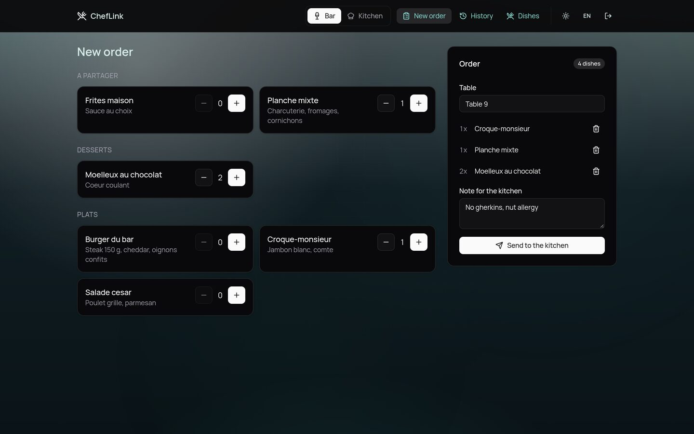
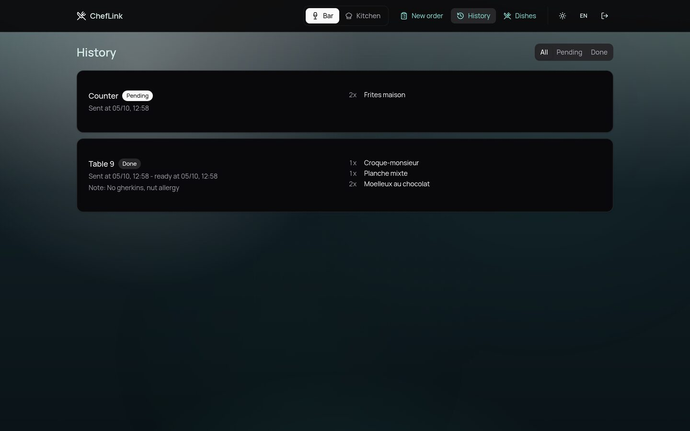
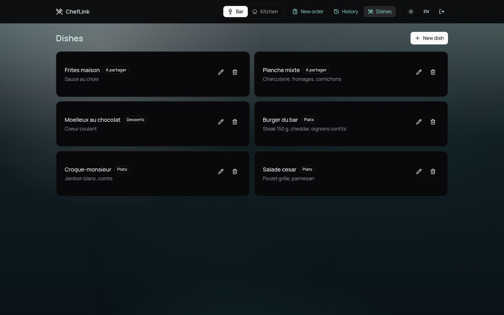
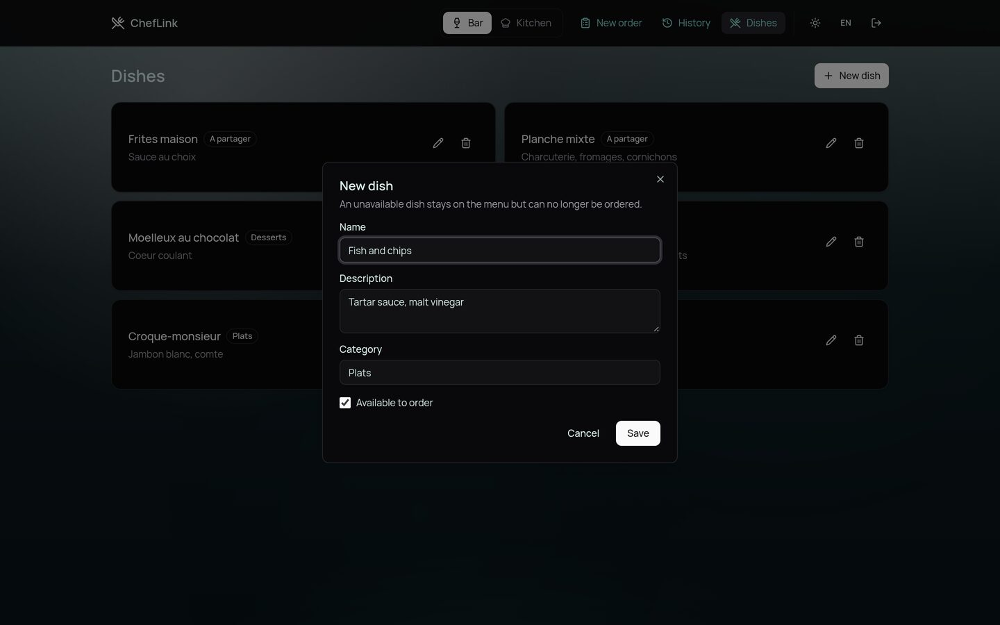
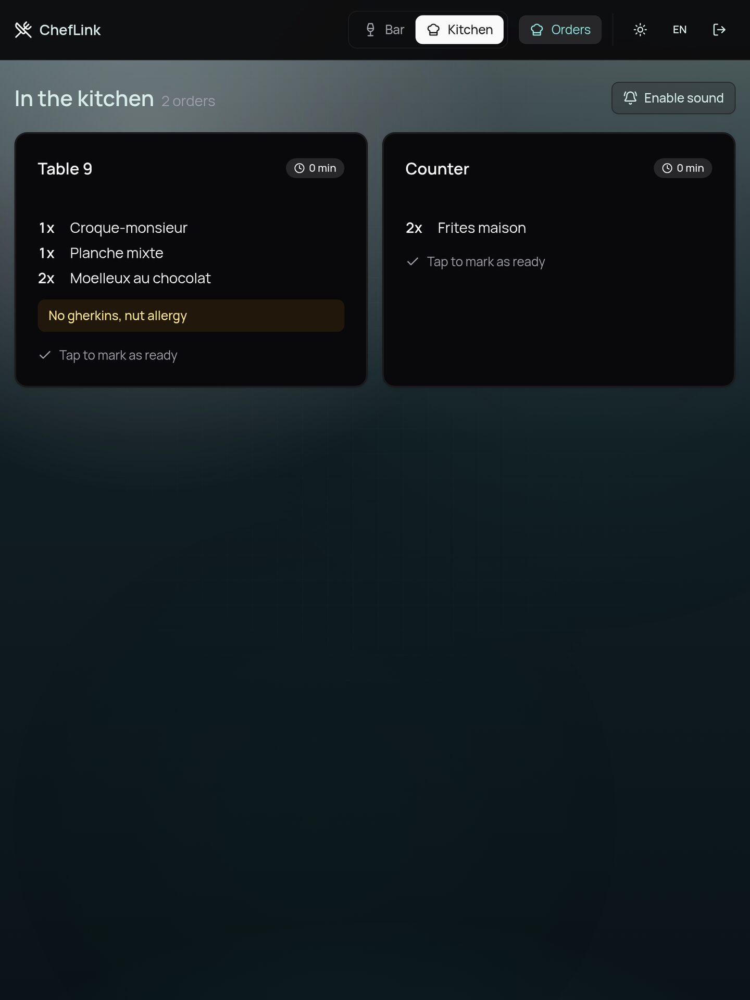
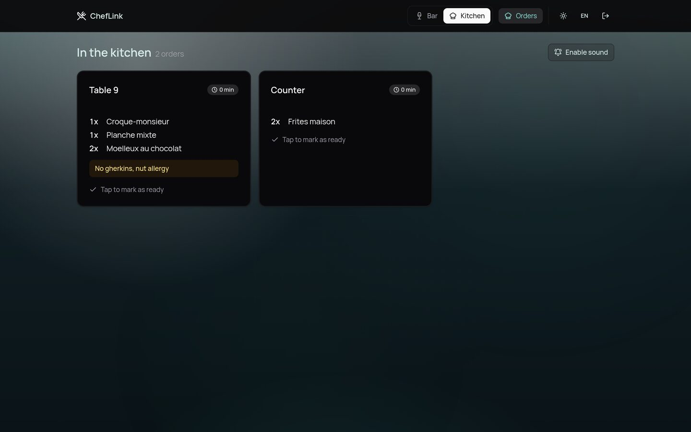
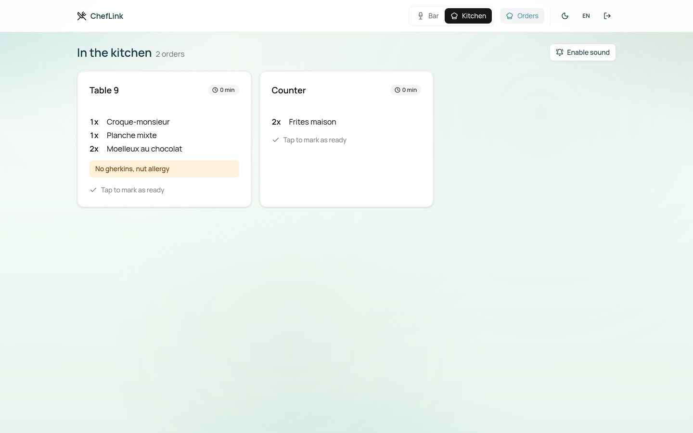
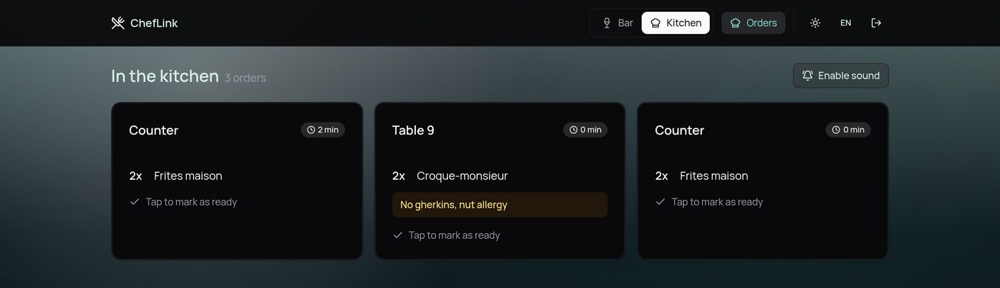
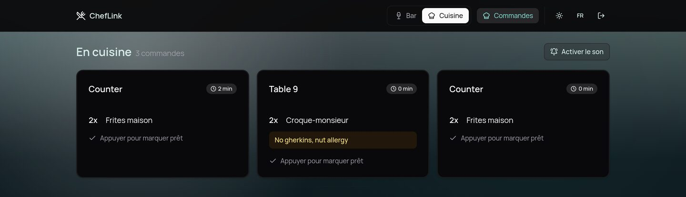

<div align="center">

# 🍽️ ChefLink

**From the counter to the kitchen, without shouting.**

The bar sends, the tablet chimes, one tap and it's served.
On Cloudflare, within the free plan.

[](https://react.dev)
[](https://tanstack.com/start)
[](https://workers.cloudflare.com)
[](https://developers.cloudflare.com/d1/)
[](https://ui.shadcn.com)
[](#-tests)
[](.github/workflows/deploy.yml)
[](#license)

</div>



---

In a bar that serves food, orders travel from the counter to the kitchen by
shouting over the coffee machine. ChefLink replaces the shouting: the server
builds the order, the kitchen gets it **in real time** with a chime, and clears
the card with one tap when it's ready.

Two modes on the same account — and the mode belongs to the **device**, not the
person. The counter station stays in bar mode, the kitchen tablet in kitchen
mode, and either can switch with one click.

> The interface comes in **French and English**, French by default because that
> is the language of the team using it. Everything below — and every comment in
> the code — explains the decisions, not just the mechanics.

## ✨ What's inside

- 🔔 **Real time, with a chime** — the order lands in the kitchen without a
  reload, and the tablet rings
- 👆 **One tap means ready** — the whole card is the button, and the update is
  optimistic
- 🍔 **Menu editable mid-service** — create, edit, delete a dish, or mark it
  unavailable without removing it
- 📋 **Order history with statuses** — sent at, ready at, filterable
- 📝 **Free-form note per order** — "no onions, allergy", highlighted in the
  kitchen
- ⏱️ **Waiting badge** — the card changes colour at 8 then 15 minutes
- 🔐 **Session authentication** — PBKDF2 through WebCrypto, `httpOnly` cookie
- 📱 **Built for a tablet** — large targets, single column in portrait
- 🌗 **Light or dark**, remembered per device, applied before the first paint
- 🌍 **French and English**, chosen per device and resolved **server-side**, so
  the first HTML is already in the right language
- ☁️ **Cloudflare end to end** — Workers, D1, a Durable Object, free plan
- ✅ **14 tests** on the business rules and the message catalogues, with no
  database and no browser

| | |
| :--: | :--: |
|  |  |
| **Order taking** — menu, basket, note | **History** — statuses and timestamps |
|  |  |
| **Dishes** — the menu, editable mid-service | **Editing** — name, category, availability |

<div align="center">


**The kitchen on a portrait tablet** — the shape the station actually has.

</div>

| | |
| :--: | :--: |
|  |  |
| **Dark** — the default | **Light** — one tap away |

Same screen, one tap apart. The note carries the allergy, so it gets a tone of
its own in each theme rather than one amber that only works against a dark
background.

## 🌍 Two languages

French and English, through [Paraglide JS](https://paraglidejs.com) — the
library TanStack Router's own i18n guide builds its examples on. TanStack ships
no i18n package of its own.

The copy lives in `messages/fr.json` and `messages/en.json` and is **compiled**
into `src/paraglide`: each message becomes a function, so a page only ships the
messages it uses, and a typo in a message name is a type error rather than a
blank on a screen.

| | |
| :--: | :--: |
|  |  |
| **English** | **French** |

The same screen, one button apart - the `EN`/`FR` in the header. The order note
is not translated and should not be: it is what the server typed.

Three decisions worth the words:

**The language is a cookie, not `localStorage`.** The theme and the bar/kitchen
mode live in `localStorage` and are corrected after the server has rendered —
for a colour that costs nothing, and an inline script hides it. Text cannot be
corrected that way: the page would arrive in French and visibly switch. A cookie
is readable by the server, so the first HTML is already in the right language.

**The locale never appears in the URL.** The screens sit behind a login on fixed
tablets: there is nothing to index and nothing to share, so `/fr/cuisine` would
only add another thing to keep in sync — starting with `/api/ws`, which must not
be localized. Resolution order is cookie → `Accept-Language` → French.

**Some French stays in the code, on purpose.** `en_attente` and `terminee` are
in D1; `clair` and `sombre` are in the browsers of devices already in service.
Renaming them would need a migration for the first and would silently reset
everyone's choice for the second. They are stored values, not copy — the labels
on top of them are translated.

| | |
| :-- | :-- |
| `messages/*.json` | the copy, one file per language |
| `i18n.config.ts` | compiler options, shared by Vite and `npm run typecheck` |
| `src/server.ts` | resolves the locale for the request, before anything renders |
| `src/lib/locale.ts` | language names and the date formats that follow them |

Plurals go through CLDR rather than a parenthesised `(s)`: French counts 0 as
singular ("0 commande"), English does not ("0 orders"). Dates follow suit —
English here means British English, because 05/10 should not mean October in one
language and May in the other on the same screen.

## 🚀 Getting started

```bash
npm install
npm run build        # builds the Worker
npm run db:migrate   # migrations against the local D1
npm run db:seed      # one account and a menu of six dishes
npm run preview      # wrangler dev: the real Cloudflare runtime, locally
```

→ http://localhost:3000 · `bar@exemple.fr` / `motdepasse`

Change those credentials with `SEED_EMAIL` and `SEED_PASSWORD` before running
`db:seed`.

### `dev` or `preview`?

| | `npm run dev` | `npm run preview` |
| :-- | :--: | :--: |
| Hot reload | ✅ | ❌ |
| D1 | ✅ | ✅ |
| **Real time** | ❌ | ✅ |

Nitro does not publish `exports.cloudflare.ts` in its dev server, so the Durable
Object does not exist under `vite dev`. The app keeps working — screens catch up
on the safety-net refetch — and the server **says so** in the console rather than
going quietly silent. To work on anything real-time, use `preview`.

## ☁️ Deploying

**Every push to `main` deploys itself** — see
[`.github/workflows/deploy.yml`](.github/workflows/deploy.yml). The workflow
type-checks, tests and builds, then applies the D1 migrations and ships the
Worker. A pull request runs the same checks and stops there, so nothing reaches
production without clearing the same bar.

Migrations run **before** the Worker goes live: new code may need a column the
old code ignored, whereas old code survives an extra column just fine. The
corollary is worth remembering — a *destructive* migration (a dropped or renamed
column) would break the version still serving traffic for a few seconds, so that
kind of change takes two deploys, not one.

Two repository secrets are needed before the first push — Settings > Secrets
and variables > Actions:

| Repository secret | What it is |
| :-- | :-- |
| `CLOUDFLARE_API_TOKEN` | a token with "Edit Workers" and "D1 Edit" |
| `CLOUDFLARE_ACCOUNT_ID` | your Cloudflare account id |

Without them the `verify` job still passes and `deploy` fails on the migration
step, which is the right way round: nothing ends up half-deployed.

Starting from a fresh account instead? Create the database, point
`database_id` in `wrangler.jsonc` at it, and lay down the starting data once —
the workflow deliberately never seeds production:

```bash
wrangler d1 create cheflink
npm run db:migrate:remote
npm run db:seed:remote
```

To deploy from your machine instead: `npm run deploy`.

`wrangler.jsonc` declares the two bindings: `DB` (D1) and `REALTIME` (the
`Realtime` Durable Object, registered under `new_sqlite_classes` — the only
storage backend available on the free plan). Nitro merges that file with its
build output into `.output/server/wrangler.json`, which is what wrangler ships.

## 🧱 How it's built

```
src/
  lib/orders.ts        pure rules: statuses, line merging, urgency
  lib/locale.ts        language names, and the date formats that follow them
  db/                  Drizzle schema and access to the request's D1
  paraglide/           generated from messages/ - not committed
  server.ts            Worker entry: resolves the request's language
  server/
    cloudflare.ts      the current request's bindings (D1, Durable Object)
    password.ts        PBKDF2 via WebCrypto, shared with the seed script
    auth.ts            sessions and the requireUser guard
    realtime.ts        the Durable Object: WebSocket and broadcast
    events.ts          publish to the hub, attach a screen to it
    functions/         server functions: auth, dishes, orders
  hooks/               WebSocket subscription and reconnect, Web Audio chime
  routes/
    connexion.tsx      public
    _app.tsx           shell and access guard: everything below it is protected
    _app.bar.*         bar mode
    _app.cuisine.tsx   kitchen mode
    api.ws.ts          the real-time entry point
messages/{fr,en}.json  every line of copy in the interface
project.inlang/        the inlang project: languages and message format
i18n.config.ts         Paraglide options, shared by Vite and the CLI
drizzle/               SQL migrations applied by wrangler
scripts/seed.ts        generates the demo data as SQL
scripts/i18n-compile.ts  compiles the messages outside Vite, for tsc
exports.cloudflare.ts  exposes the Realtime class to the Worker
wrangler.jsonc         D1 and Durable Object bindings
```

### Real time

The server publishes three events — `order.created`, `order.completed`,
`dishes.changed` — over a **WebSocket** (`/api/ws`).

**Why a Durable Object.** A Worker is stateless and replicated: the bar station
and the kitchen tablet can land on two different isolates, or two different
continents. An in-memory bus cannot connect them. A Durable Object is the
opposite — exactly *one* instance for a given id, anywhere in the world. It is
the one place in this infrastructure where "everyone is looking at the same
object" means something, so that is where the connections live.

It uses **hibernation** (`acceptWebSocket`): the object can be evicted from
memory between orders while the connections stay open. A tablet plugged in for a
whole shift therefore doesn't bill continuous execution time.

The trade-off we accepted: `EventSource` reconnected on its own, `WebSocket`
doesn't. `useAppEvents` does that work, with exponential backoff so it doesn't
hammer a server that is already down — and it treats **every open as a
synchronisation point**. Without that, an order sent while the tablet is
hydrating, or during a wifi drop, would be lost for good, and the screen would
show "nothing to prepare" with an order sitting in the database. That happened
during testing; it's fixed.

### The sound

Synthesised with the Web Audio API: two notes, no file, no licensing question.

**Browsers refuse to play sound before a user interaction.** A tablet opened in
the morning and never touched again would stay silent all day — silently,
with nothing to indicate it. Hence the "Activer le son" button at the top of the
kitchen screen: while it is there, the sound does not work. A button to tap at
the start of service beats a chime you discover at 8pm has never worked.

### Decisions visible in the code

- **No notion of price.** The app carries orders to the kitchen, it doesn't take
  payment: the bill is settled at the till.
- **Order lines copy the dish name** at send time. Renaming or deleting a dish
  therefore never rewrites history.
- **The name shown in the kitchen is read from the database server-side**, never
  taken from the browser. The client only sends ids and quantities.
- **Completing an order is idempotent.** The `WHERE` clause is on
  `status = 'en_attente'`: if two people tap the same card a second apart, the
  second one changes nothing and sees no error. In service, that is not an
  incident.
- **The kitchen update is optimistic**: the card disappears under the finger,
  without waiting for the server, and comes back if the write fails.
- **Grouped writes go through `db.batch()`**, not a transaction: D1 exposes no
  `BEGIN`/`COMMIT`, but guarantees a batch applies entirely or not at all.
- **PBKDF2-SHA256, 210,000 iterations**, rather than scrypt: the Workers runtime
  offers neither `node:crypto.scrypt` nor a WebCrypto equivalent. The iteration
  count is stored with the hash, so raising it later won't break existing
  accounts.
- **A hub failure never cancels the write.** An order that is saved but not
  broadcast is recoverable; an order that is lost is not.
- **The theme belongs to the device**, like the bar/kitchen mode: the counter
  station and the kitchen tablet aren't under the same light. Dark is the
  default — a kitchen is often a dim corner — and an inline script in the
  `<head>` applies the stored choice *before* the first paint, so a device set
  to light never flashes the server-rendered dark page first.

## ✅ Tests

```bash
npm test          # business rules (Vitest)
npm run typecheck
```

The order rules live in `src/lib/orders.ts` with no database and no React
imports: the state machine, line merging, urgency thresholds. Which is why these
tests run in milliseconds.

`src/lib/i18n.test.ts` guards the message catalogues instead, because nothing
else does: Paraglide is silent about a message that exists in French and not in
English — it serves French and compiles fine. The tests check that both files
carry the same keys, that a translation has not dropped a `{placeholder}`, and
that no message has outlived the code that called it.

## ⚠️ Not included

- **No roles.** Any signed-in account can switch to kitchen mode, complete an
  order and edit the menu. That was the choice; separate roles would take one
  column and one guard per screen, nothing more.
- **No order cancellation.** An order goes from pending to done, and nothing
  else. The state machine is ready for a third state without breaking.
- **A single venue.** The Durable Object id is the `HUB` constant in
  `src/server/events.ts`; serving several bars would mean turning it into the
  venue's id — and nothing else would move.
- **No real time under `npm run dev`** (see above).
- **No ticket printing**, and no link to a point-of-sale system.

## License

MIT.
